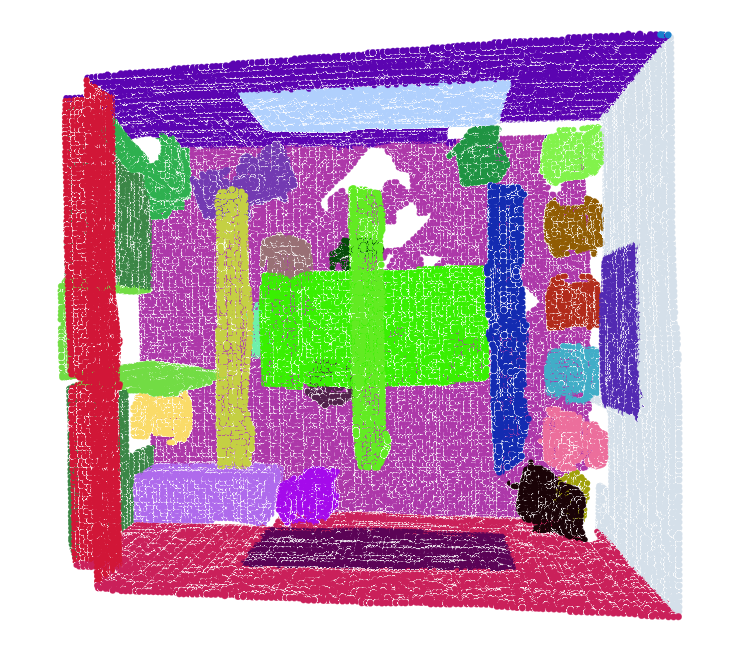

# 融合位置特征的两阶段点云实例分割方法


## Operating environment
```text
Ubuntu 18.04
Pytorch 1.7.1
Nvidia GTX TITAN X 
```

## Dataset
```bash
* Download 3D indoor parsing dataset (S3DIS Dataset). Version 1.2 of the dataset is used in this work.
cd cpp_utils/cpp_wrappers & ./compile_wrappers.sh
python utils/collect_indoor3d_data.py
```

## Model
```bash
* The main folder is the main file used to train the semantic model and the instance model.

python main/sem_train.py 
** Generating a Model for Semantic Segmentation of Point Clouds
```


```bash
python main/ins_train.py 
** Fusion Position generate Model for Point Cloud Instance Segmentation
```


## Result


## Acknowledgemets
This code largely benefits from following repositories:
[PointNet++](https://github.com/charlesq34/pointnet2),
[DiscLoss-tf](https://github.com/hq-jiang/instance-segmentation-with-discriminative-loss-tensorflow),
[ASIS](https://github.com/WXinlong/ASIS),
[JSNet](https://github.com/dlinzhao/JSNet) and
[Paconv](https://github.com/CVMI-Lab/PAConv)